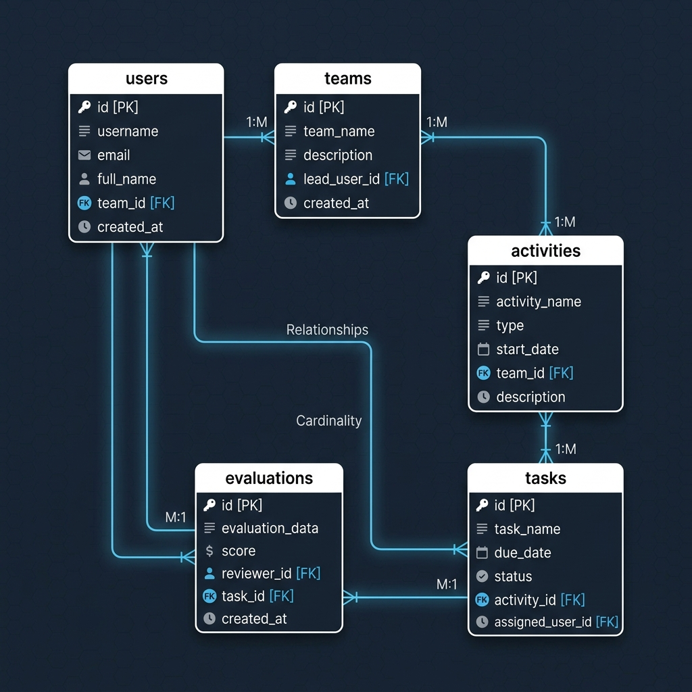
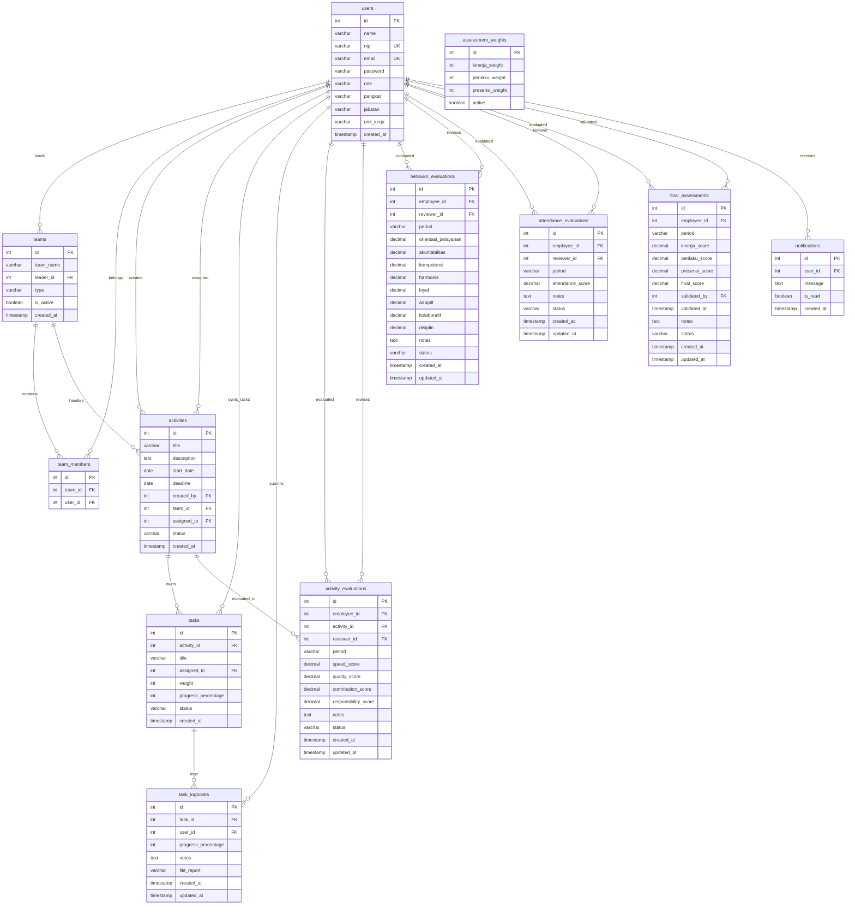
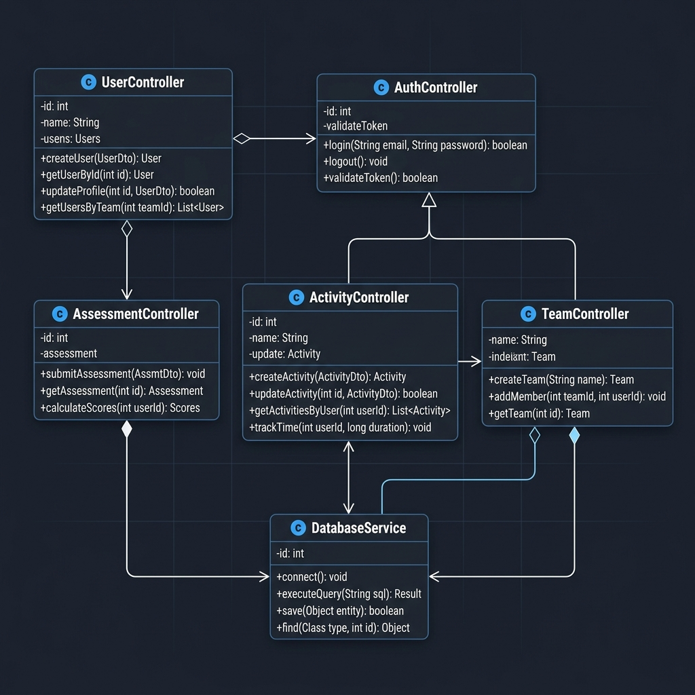
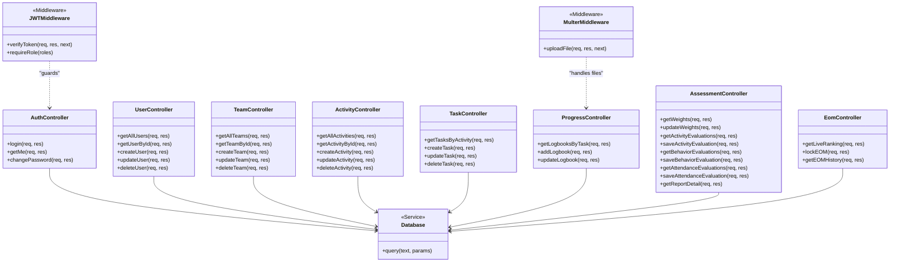
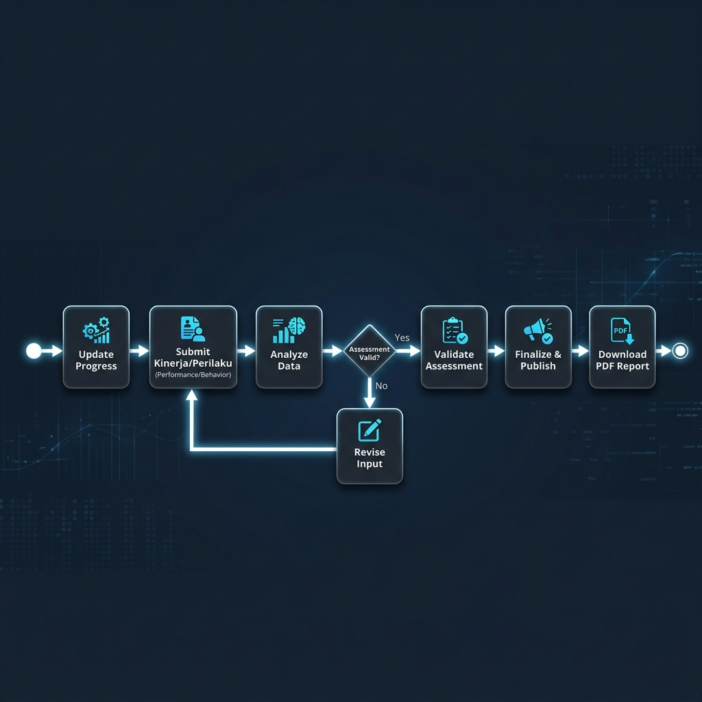
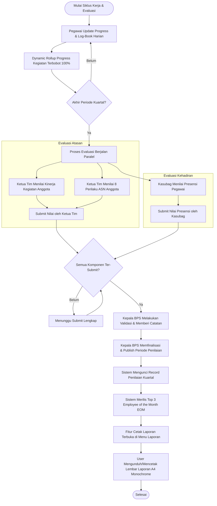
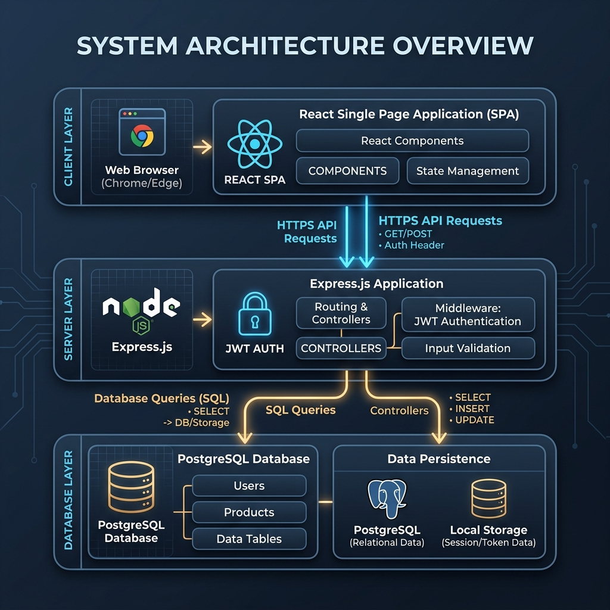
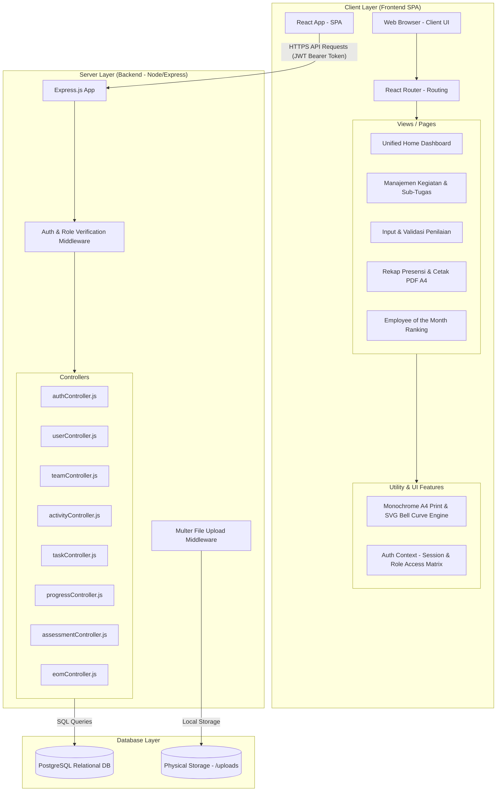

# Product Requirement Document (PRD)
## Sistem Monitoring dan Penilaian Kinerja Pegawai BPS Kabupaten Solok (SIMONEV)

---

## 1. Pendahuluan & Latar Belakang
**SIMONEV** adalah platform berbasis web yang dikembangkan khusus untuk Badan Pusat Statistik (BPS) Kabupaten Solok guna memfasilitasi monitoring kegiatan pegawai, pengelolaan presensi bulanan, dan evaluasi kinerja pegawai secara berkala. Sistem ini dirancang untuk menggantikan pencatatan manual, meningkatkan akuntabilitas kinerja, serta menyajikan proses penentuan predikat *Employee of the Month* (EOM) secara transparan dan objektif berdasarkan akumulasi nilai penilaian kinerja yang sah.

---

## 2. Arsitektur & Tumpukan Teknologi (Tech Stack)
* **Frontend**: React 18 (Vite) + Tailwind CSS (desain modern & responsif) + Recharts (grafik pemantauan progres).
* **Backend**: Node.js + Express.js (RESTful API).
* **Database**: PostgreSQL (menyimpan data relasional presensi, tim, tugas, review, dan EOM).
* **Autentikasi**: JSON Web Token (JWT) untuk keamanan sesi + hashing `bcrypt` untuk penyimpanan password aman.
* **Unggah Berkas**: Multer (untuk menyimpan laporan bukti kegiatan pegawai secara fisik di direktori `./uploads`).

---

## 3. Matriks Peran & Hak Akses (Role-Access Matrix)

Sistem ini memiliki **4 (empat) Peran Statis Pengguna** di database, sedangkan peran **Ketua Tim** didefinisikan secara dinamis sebagai **Pegawai yang ditunjuk memimpin suatu Tim Kerja** (`teams.leader_id = users.id`).

| Modul/Fitur | Admin | Kasubag | Kepala BPS | Ketua Tim (Dinamis) | Pegawai |
| :--- | :---: | :---: | :---: | :---: | :---: |
| **Manajemen Pengguna (Staf)** | **CRUD** | Hanya Lihat | Hanya Lihat | Hanya Lihat | - |
| **Manajemen Tim Kerja** | **CRUD** | Hanya Lihat | Hanya Lihat | Hanya Lihat | - |
| **Manajemen Kegiatan (Tugas)** | **CRUD** | Hanya Lihat | Hanya Lihat | **CRUD** | Hanya Lihat |
| **Update Progres & Bukti** | - | - | - | - | **Update & Upload** |
| **Monitoring Progres Staf** | Lihat Semua | Lihat Semua | Lihat Semua | Lihat Timnya | - |
| **Input Presensi Bulanan** | **CRUD** | **CRUD** | Hanya Lihat | Hanya Lihat (Milik Sendiri) | Hanya Lihat (Milik Sendiri) |
| **Input Penilaian Kinerja** | **CRUD** | **Input (Umum/Staf)** | - | **Input (Anggota Tim)** | - |
| **Validasi & Revisi Penilaian** | **Bypass** | - | **Validasi & Catatan** | - | Hanya Lihat (Tervalidasi) |
| **Pemeringkatan & Kunci EOM** | **Bypass** | - | **Kalkulasi & Kunci** | - | Hanya Lihat (Top 3) |
| **Menu "Nilai Saya" (Sidebar)** | **Hidden** | **Hidden** | **Hidden** | Tampil | Tampil |

> [!NOTE]
> **Batasan Visibilitas Menu Sidebar**: Menu "Nilai Saya" (My Score) hanya relevan untuk pegawai pelaksana yang dievaluasi. Oleh karena itu, demi menjaga kebersihan antarmuka dan relevansi fungsional, menu ini secara dinamis disembunyikan bagi pengguna dengan peran **Admin**, **Kepala BPS**, dan **Kasubag**.

---

---

## 4. Spesifikasi Fungsional Modul Utama

### 4.1. Modul Autentikasi & Profil Pengguna
* **Login Multi-Role**: Sistem memvalidasi email dan password melalui token JWT yang disimpan di lokal browser (`localStorage`).
* **Deteksi Ketua Tim Dinamis**: Saat login atau mengambil data profil, sistem mendeteksi jika pegawai tersebut memimpin minimal satu tim kerja (`is_leader = true`). Status ini dikodekan ke dalam sesi JWT dan data profil.
* **Profil Pegawai**: Menampilkan data pribadi lengkap seperti Nama, NIP, Pangkat/Golongan, Jabatan, Unit Kerja, status sebagai Ketua Tim (jika aktif), dan Riwayat Kinerja.
* **Keamanan Akun**: Pengguna dapat mengubah kata sandi default demi keamanan.

### 4.2. Modul Manajemen Pengguna (Khusus Admin)
* **CRUD Pegawai**: Menambahkan staf baru, mengubah detail profil (pangkat/jabatan/unit kerja), menghapus akun, dan mengatur ulang kata sandi pegawai. Peran yang dapat dipilih dibatasi hanya pada **Pegawai**, **Kasubag**, **Kepala BPS**, dan **Admin**.

### 4.3. Modul Manajemen Tim Kerja (Khusus Admin)
* **Pembentukan Tim**: Admin dapat membuat tim kerja baru dan menetapkan salah satu pegawai reguler sebagai pemimpinnya (`leader_id`). Pegawai yang terpilih secara otomatis memperoleh kapabilitas "Ketua Tim" untuk tim tersebut. Kepala BPS dan Kasubag dieksklusi secara otomatis dari opsi pemilihan Ketua Tim.
* **Manajemen Anggota**: Memilih pegawai reguler untuk masuk ke dalam tim kerja tersebut secara *multi-select*. Kepala BPS, Kasubag, serta pegawai yang telah ditunjuk sebagai Ketua Tim pada tim tersebut secara otomatis disembunyikan/dikecualikan dari opsi pilihan anggota untuk menghindari redundansi peran.

### 4.4. Modul Manajemen Kegiatan & Pemantauan Progres (Sub-Tugas & Log-Book harian)
* **Pembuatan & Distribusi Kegiatan**: Pembuat kegiatan (Ketua Tim Dinamis/Admin) dapat mendefinisikan nama kegiatan utama, deskripsi, deadline, serta menugaskannya secara kelompok (Tim) maupun individu (Staf).
* **Delegasi Sub-Tugas (Granular Delegation)**:
  - Sebuah kegiatan utama dapat dipecah menjadi beberapa **Sub-Tugas** kerja.
  - Setiap sub-tugas wajib didelegasikan kepada **tepat satu orang** pegawai pelaksana (termasuk Ketua Tim).
  - Setiap sub-tugas memiliki bobot persentase kontribusi (`weight`) masing-masing.
  - Sistem menerapkan validasi ketat di mana **akumulasi bobot seluruh sub-tugas dalam satu kegiatan harus tepat 100%**.
  - **Hak Akses Kelola Sub-Tugas**: Admin, Kepala BPS, dan Kasubag memiliki hak mengelola sub-tugas di seluruh kegiatan. Ketua Tim (is_leader) hanya berhak mengelola sub-tugas pada kegiatan yang timnya terlibat atau kegiatannya sendiri. Pegawai biasa dilarang mengelola sub-tugas.
* **Input Harian & Progress Log-Book (Pegawai)**:
  - Setiap pegawai yang mendapat disposisi sub-tugas dapat memasukkan progres penyelesaian sub-tugas mereka secara bertahap (0% hingga 100%).
  - Pegawai melaporkan progres melalui pengisian **Log-Book harian** yang mencakup persentase progress terbaru, deskripsi/catatan kerja tertulis, serta unggahan berkas bukti dukung (PDF/Dokumen/Gambar).
  - **Hak Akses Log-Book Mandiri**: Pegawai (termasuk Ketua Tim) hanya diperbolehkan menambah progres, mengisi log-book, dan mengedit log-book milik sendiri khusus pada sub-tugas yang **ditugaskan personal kepada diri mereka sendiri**.
  - **In-place Log-book Editing**: Pegawai dapat mengedit kembali entri log-book yang sudah dikirim (hanya untuk log-book miliknya sendiri pada tugasnya) jika memerlukan penyesuaian catatan atau berkas bukti.
* **Kalkulasi Progress Aritmatika Terbobot (Dynamic Rollup)**:
  - Sistem menghitung persentase progress total kegiatan utama secara otomatis dan real-time di database berdasarkan rata-rata terbobot (Weighted Average) dari progress seluruh sub-tugasnya:
    $$\text{Progress Kegiatan Utama} = \sum \left(\text{Progress Sub-Tugas} \times \frac{\text{Bobot Sub-Tugas}}{100}\right)$$
  - Setiap penambahan atau pembaruan log-book akan langsung memicu perhitungan ulang status kegiatan utama (`pending`, `on_progress`, atau `selesai`).
* **Unified Monitoring Panel & Linimasa Log-Book (Atasan/Pimpinan)**:
  - Atasan (Ketua Tim, Kasubag, Kepala BPS, Admin) dapat mengakses panel monitoring kegiatan yang menyajikan daftar sub-tugas lengkap dengan bobot, penanggung jawab, progress terkini, serta linimasa harian (log-book timeline) yang dapat diekspansi untuk melacak histori pengerjaan staf beserta file bukti pendukung secara real-time.
* **Grafik Dashboard Terintegrasi**: Halaman depan (Monitoring & Beranda) menampilkan rekapitulasi visual rata-rata progress kegiatan tim secara otomatis tanpa input ganda.

#### 4.5. Modul Penjadwalan & Kriteria Penilaian Kuartal
* **Periode Penilaian Berbasis Kuartal**:
  - Penilaian dilakukan setiap kuartal (3 bulan sekali):
    - **Q1**: Januari - Maret (Aktif/Dibuka otomatis mulai **1 April**)
    - **Q2**: April - Juni (Aktif/Dibuka otomatis mulai **1 Juli**)
    - **Q3**: Juli - September (Aktif/Dibuka otomatis mulai **1 Oktober**)
    - **Q4**: Oktober - Desember (Aktif/Dibuka otomatis mulai **1 Januari** tahun berikutnya)
  - Sistem mendeteksi tanggal berjalan dan mengaktifkan pengisian periode penilaian secara otomatis pada hari pertama bulan pertama kuartal berikutnya.
* **Tiga Komponen Evaluasi**:
  - **Kinerja** (Skor rata-rata penilaian kegiatan)
  - **Perilaku** (Skor rata-rata 8 nilai utama ASN)
  - **Presensi** (Skor kehadiran kumulatif)
* **Kustomisasi Bobot (Khusus Admin)**:
  - Admin dapat merubah persentase bobot masing-masing dari ketiga komponen diatas secara dinamis di database (misal: Kinerja 50%, Perilaku 30%, Presensi 20%).
  - Perubahan bobot secara otomatis berlaku untuk semua periode penilaian yang **belum disahkan/finalisasi** oleh Kepala BPS.

### 4.6. Alur & Spesifikasi Teknis Evaluasi Kinerja & Perilaku
* **Penilaian Kinerja per Kegiatan (Oleh Ketua Tim)**:
  - Ketua Tim melakukan penilaian kinerja berdasarkan daftar kegiatan yang **selesai** (`selesai`) atau **masih aktif** (`on_progress`/`pending`) dalam periode kuartal tersebut.
  - Setiap kegiatan dinilai secara individu per karyawan pelaksana menggunakan 4 komponen (Kecepatan, Kualitas, Kontribusi, Tanggung Jawab) skala `0-100`.
  - Penilaian kinerja kegiatan ini dapat disimpan sebagai **Draft** sebelum di-submit secara final.
  - **Nilai Akhir Kinerja**: Rata-rata aritmatika dari semua nilai kegiatan karyawan yang dievaluasi pada periode bersangkutan.
* **Penilaian Perilaku ASN (Oleh Ketua Tim)**:
  - Ketua Tim menilai perilaku masing-masing anggota timnya berdasarkan 8 poin nilai perilaku:
    1. **Orientasi Pelayanan**
    2. **Akuntabilitas**
    3. **Kompetensi**
    4. **Harmonis**
    5. **Loyal**
    6. **Adaptif**
    7. **Kolaboratif**
    8. **Disiplin**
  - Penilaian dapat disimpan sebagai **Draft** sebelum di-submit secara final.
* **Penilaian Presensi Staf (Oleh Kasubag)**:
  - Kasubag Umum melakukan input nilai presensi (skala `0-100`) untuk seluruh pegawai BPS (kecuali Kasubag & Kepala BPS).
  - Proses input presensi berjalan secara paralel dengan proses penilaian oleh Ketua Tim.
  - Kasubag dapat menyimpan input presensi sebagai **Draft** sebelum di-submit secara final.
* **Sistem Notifikasi & Alur Pengiriman**:
  - Setiap kali Ketua Tim atau Kasubag melakukan **Submit** penilaian secara final, sistem akan men-trigger **Notifikasi Sesi** kepada Kepala BPS.

### 4.7. Modul Review, Validasi & Finalisasi Kepala BPS
* **Validasi Bertahap Kepala BPS**:
  - Kepala BPS dapat melakukan peninjauan dan **Validasi** penilaian masing-masing pegawai *apabila dan hanya jika* ketiga komponen (Kinerja, Perilaku, Presensi) untuk pegawai bersangkutan telah di-submit secara final oleh penilai masing-masing.
* **Tinjauan & Penguncian Final (Publish)**:
  - Kepala BPS dapat mereview kembali hasil validasi seluruh pegawai di suatu periode sebelum melakukan **Finalisasi**.
  - Saat Kepala BPS melakukan **Finalisasi/Publish**, sistem akan:
    1. Mengunci seluruh record penilaian di periode kuartal tersebut secara permanen.
    2. Merilis hasil akhir secara transparan sehingga masing-masing pegawai dapat login dan melihat skor akhir mereka beserta detail nilainya.
    3. Men-trigger **Notifikasi Rilis Penilaian** kepada seluruh pegawai.
    4. Merilis **Top 3 Best Employee** (Live Ranking) kuartal tersebut di halaman Beranda/Best Employee untuk dilihat oleh seluruh karyawan.
* **Aturan Tie-Breaker**: Jika terdapat skor kembar (*tie*) pada akumulasi nilai total kuartal, pemeringkatan secara otomatis disaring berdasarkan Skor Perilaku tertinggi, disusul Skor Kinerja tertinggi.

### 4.8. Modul Unified Dashboard (Beranda Terintegrasi)
* **Penyatuan Halaman Monitoring**: Fitur monitoring yang sebelumnya merupakan halaman terpisah kini diintegrasikan secara terpadu ke dalam halaman utama (Beranda/Home). Langkah ini bertujuan mengoptimalkan tata letak visual tanpa adanya ruang kosong (*blank space*) dan menyajikan dasbor satu-pintu (one-stop monitoring dashboard).
* **Fungsionalitas Visual di Beranda**:
  - **Progress Bar Kinerja Tim**: Rekapitulasi visual rata-rata penyelesaian seluruh kegiatan/tugas tim secara real-time.
  - **Daftar Tugas & Log-Book Terbaru**: Menampilkan sub-tugas yang sedang aktif beserta linimasa entri log-book harian teranyar yang diinput oleh staf.
  - **Radial Kehadiran (Presensi)**: Visualisasi tingkat presensi bulanan pegawai yang dinamis.
  - **Best Employee Highlight (EOM)**: Penayangan secara terhormat untuk Top 3 *Employee of the Month* yang telah dipublish untuk kuartal aktif.
  - **Tren Kinerja Personal**: Grafik tren perkembangan nilai performa total dari kuartal ke kuartal berikutnya.

### 4.9. Modul Lembar Evaluasi Kinerja & Printable Report (Monochrome A4 PDF)
* **Aksi Cetak Laporan**: Menyediakan kolom **Aksi** pada halaman Laporan dengan ikon unduh (download) laporan evaluasi kinerja bagi masing-masing karyawan.
* **Aturan Rilis**: Tombol unduh laporan ini **hanya aktif dan dapat digunakan** jika status penilaian pada periode terpilih telah secara resmi di-finalisasi (dipublish) oleh Kepala BPS.
* **Format Monochrome Formal (Standar A4)**:
  - Laporan dirancang menggunakan CSS `@media print` sehingga saat dicetak/disimpan sebagai PDF, sistem secara otomatis menyembunyikan sidebar navigasi, header bar, serta tombol cetak.
  - Laporan dikonversi menggunakan palet warna hitam-putih formal (*monochrome*) dan batas garis yang bersih agar terlihat profesional saat dicetak di kertas fisik A4.
* **Struktur Lembar Evaluasi Kinerja**:
  1. **Header Dokumen**: Judul laporan resmi, periode penilaian, identitas lengkap Pegawai (Nama, NIP, Pangkat/Golongan, Jabatan, Unit Kerja), dan identitas lengkap Penilai.
  2. **Kurva Predikat Distribusi Normal (SVG Bell-Curve)**: Grafik kurva lonceng dinamis yang di-render secara matematis melalui koordinat SVG, menunjukkan posisi skor akhir karyawan terhadap rata-rata kurva distribusi normal.
  3. **Detail Evaluasi Komponen Kinerja**: Tabel komprehensif yang memuat nama kegiatan utama, bobot sub-tugas, catatan log-book bukti kerja, dan skor kegiatan (0-100).
  4. **Detail Evaluasi Komponen Perilaku**: Tabel 8 dimensi perilaku utama ASN (BerAKHLAK + Disiplin) dengan skor individual dan rincian catatan.
  5. **Detail Evaluasi Komponen Presensi**: Uraian kehadiran fisik, hari terlambat, hari pulang cepat, kehadiran rapat/upacara, beserta skor presensi kumulatif.
  6. **Kalkulasi & Komentar**: Total nilai akhir terbobot (sesuai bobot persentase dari admin) dan komentar/umpan balik formal dari Kepala BPS.
  7. **Footer Tanda Tangan**: Tanggal penilaian resmi, tempat tanda tangan, nama terang, serta jabatan Penilai.

---

## 5. Non-Functional Requirements & Security
* **Data Integrity**: Menghapus data induk (seperti user atau tim) akan memicu operasi *cascade* atau *set null* yang aman untuk mencegah *broken reference* di database PostgreSQL.
* **Session Expiry**: Token JWT diset dengan kedaluwarsa 7 hari (`7d`) untuk meminimalkan risiko pencurian sesi.
* **Folder Security**: Validasi file laporan/bukti didukung oleh sistem untuk menghindari pengunggahan file berbahaya diluar format dokumen umum.

---

## 6. Diagram Teknis Sistem

Bagian ini menyajikan arsitektur data, struktur kelas perangkat lunak, alur operasional kegiatan, dan arsitektur integrasi sistem SIMONEV.

### 6.1. Entity Relationship Diagram (ERD)
Diagram di bawah ini menggambarkan struktur tabel database PostgreSQL relasional, tipe kolom, constraint, serta kardinalitas relasi antar entitas di SIMONEV.

#### Versi Interaktif (Mermaid)

### 6.2. Class Diagram
Class diagram ini memetakan abstraksi struktur modul backend MVC (Model-View-Controller) beserta method query API dan layer middleware pada router Express.js.

#### Versi Interaktif (Mermaid)

### 6.3. Activity Diagram (Alur Proses Penilaian Kinerja)
Diagram alur aktivitas di bawah ini mendeskripsikan siklus pemantauan harian oleh pegawai hingga tahapan evaluasi bertahap, finalisasi Kepala BPS, dan pencetakan PDF formal.

#### Versi Interaktif (Mermaid)

### 6.4. Arsitektur Diagram
Diagram arsitektur fisik SIMONEV memperlihatkan integrasi berlapis antara aplikasi React Single Page Application (SPA), server Express.js API, sistem berkas lokal, serta server database relasional PostgreSQL.

#### Versi Interaktif (Mermaid)

