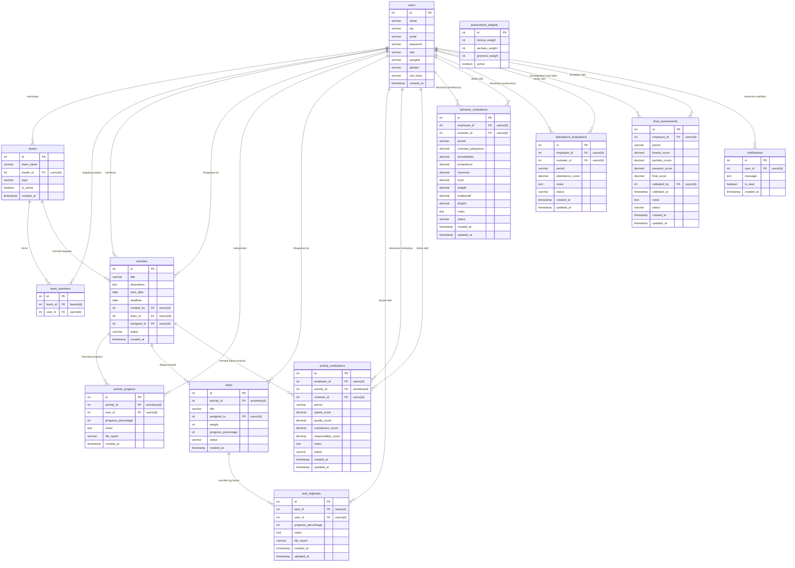

# Sistem Penilaian Kinerja Karyawan (Badan Pusat Statistik Kabupaten Solok)

## Anggota Kelompok
1. Fathiyya Fitriani Refananda - M0405241013
2. Jonathan Seth Saloh - M040524014
3. Siti Khodijah Nailah - M0405241015

## Tentang Sistem
Sistem Penilaian Kinerja Karyawan ini adalah aplikasi berbasis web yang dirancang khusus untuk **Badan Pusat Statistik (BPS) Kabupaten Solok**. 

Sistem ini dibuat untuk memfasilitasi proses pemantauan tugas, logbook harian, serta evaluasi kinerja pegawai secara objektif, transparan, dan terukur berdasarkan indikator kinerja kegiatan dan aspek perilaku Ber-AKHLAK.

**Sistem ini diperuntukkan bagi:**
- **Pegawai:** Untuk mengelola tugas harian, mengisi logbook, dan melihat rapor penilaian (Employee of the Month).
- **Ketua Tim:** Untuk memanajemen kegiatan tim dan memberikan penilaian kecepatan, kualitas, kontribusi, serta perilaku Ber-AKHLAK kepada anggotanya.
- **Kasubag:** Untuk memberikan penilaian terkait tingkat kedisiplinan dan presensi (kehadiran) pegawai.
- **Kepala BPS:** Untuk meninjau, memberikan catatan, dan memvalidasi (finalisasi) seluruh penilaian yang secara otomatis menentukan predikat dan *Employee of the Month*.
- **Admin:** Untuk mengelola master data pegawai, tim, dan konfigurasi bobot penilaian.

## Class Diagram (Entity Relationship Diagram)
Berikut adalah struktur skema database PostgreSQL yang digunakan di dalam sistem ini:



## Tampilan Fitur-fitur

### 1. Login
Sistem otentikasi pengguna berdasarkan Role (Admin, Pegawai, Ketua Tim, Kasubag, Kepala BPS).
![Tampilan Login]

### 2. Dashboard / Beranda
Halaman utama yang menampilkan ringkasan performa dan notifikasi sistem.
![Tampilan Dashboard]
### 3. Manajemen Kepegawaian (Admin)
Halaman bagi admin untuk mengelola master data pegawai, penugasan peran, dan unit kerja.
![Tampilan Manajemen Pegawai]

### 4. Manajemen Tim Kerja
Fasilitas pembentukan tim (Inti/Ad-hoc) dan pengaturan ketua tim beserta anggotanya.
![Tampilan Manajemen Tim]

### 5. Manajemen Kegiatan & Logbook
Manajemen tugas harian dan target kuartal serta pelaporan logbook kegiatan oleh pegawai secara *real-time*.
![Tampilan Kegiatan & Logbook]

### 6. Evaluasi & Penilaian
Halaman pengisian evaluasi kinerja kegiatan (Ketua Tim), perilaku Ber-AKHLAK (Ketua Tim), dan nilai kehadiran (Kasubag).
![Tampilan Penilaian Tim]

### 7. Validasi Pimpinan (Kepala BPS)
Halaman finalisasi nilai dengan kalkulasi bobot otomatis serta form pemberian *feedback* tertulis dari Kepala BPS.
![Tampilan Validasi Pimpinan]

### 8. Laporan & Peringkat (Employee of the Month)
Halaman visualisasi skor akhir pegawai dan panggung penganugerahan untuk *Best Employees* di setiap periode.
![Tampilan Laporan / Employee of the Month]

## Requirements
Sebelum menginisiasi proyek ini, pastikan sistem Anda telah terinstal:
- **Node.js** (Versi 18 atau yang lebih baru)
- **PostgreSQL** (Versi 12 atau yang lebih baru)
- **npm** atau **yarn** (sebagai *package manager*)

## Instalasi & Cara Menjalankan

### 1. Clone Repository & Setup Database
1. Buka terminal dan lakukan *clone*:
   ```bash
   git clone https://github.com/fathiyyafr-ai-ipb/sistem-penilaian-kinerja-karyawan.git
   cd sistem-penilaian-kinerja-karyawan
   ```
2. Buka klien PostgreSQL Anda (misalnya pgAdmin/psql) dan buat database baru bernama `bps_kinerja`.
3. Jalankan *query* yang terdapat di dalam file `backend/schema.sql` untuk membuat seluruh tabel, lalu jalankan `backend/seed.sql` untuk memasukkan data-data contoh (dummy).

### 2. Konfigurasi & Menjalankan Backend
1. Masuk ke direktori backend:
   ```bash
   cd backend
   npm install
   ```
2. Salin file environment:
   ```bash
   cp .env.example .env
   ```
3. Buka file `.env` dan atur kredensial koneksi PostgreSQL Anda:
   ```env
   DB_USER=postgres
   DB_PASSWORD=password_anda
   DB_NAME=bps_kinerja
   DB_PORT=5432
   ```
4. Mulai server backend:
   ```bash
   npm run dev
   ```
   *(Backend akan merespons melalui `http://localhost:5000`)*

### 3. Konfigurasi & Menjalankan Frontend
1. Buka tab terminal baru dan arahkan ke direktori frontend:
   ```bash
   cd frontend
   npm install
   ```
2. Mulai server frontend:
   ```bash
   npm run dev
   ```
   *(Frontend dapat diakses di `http://localhost:3000` atau URL lain yang dimunculkan oleh Vite)*

### Akun Sandi Default (Testing)
Untuk keperluan pengujian aplikasi, silakan masuk menggunakan kredensial bawaan berikut:
- **Admin**: `admin@bps.go.id` (Pass: `password`)
- **Pegawai**: `pegawai@bps.go.id` (Pass: `password`)
- **Ketua Tim**: `ketuatim@bps.go.id` (Pass: `password`)
- **Kasubag**: `kasubag@bps.go.id` (Pass: `password`)
- **Kepala BPS**: `kepalabps@bps.go.id` (Pass: `password`)
